# 第一章 计算机系统漫游
## hello world程序
* 编译系统 [code](./code/chapter1/Makefile)
  * 预处理器
  * 编译器
  * 汇编器
  * 链接器
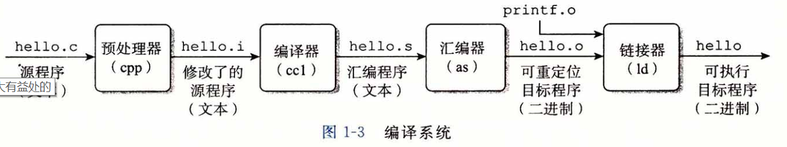

* 计算机系统中的抽象
  * 文件是对IO设备的抽象
  * 虚拟内存是对主存和磁盘IO设备的抽象
  * 进程是对处理器，主存和IO设备的抽象，是对正在运行的程序的抽象
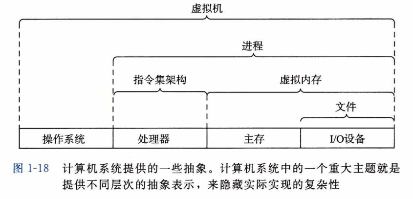

# 第二章 信息的表示和处理
## 信息存储
* 字节(byte)、字(word)和字长(word size)
  * 字节，8位的块，最小的可寻址的内存单位
  * 虚拟地址以字来编码，所以字长决定了虚拟地址空间的最大大小。每台计算机都有一个字长，指明指针的长度。 对于一个字长为w位的机器，虚拟地址范围为(0 ~ 2^w - 1)
  * 例子: [code](./code/chapter2/size/main.cpp)
* 整数表示
  * 无符号数，最高位权重是1
  * 有符号数，最高位权重是-1
  * 有符号数和无符号数运算，C语言默认将两个数都视作非负的无符号数。例子：[code](./code/chapter2/main.cpp)
* 小数表示
  * 定点表示法：二进制小数
  * 浮点表示法：符号，尾数，阶码
  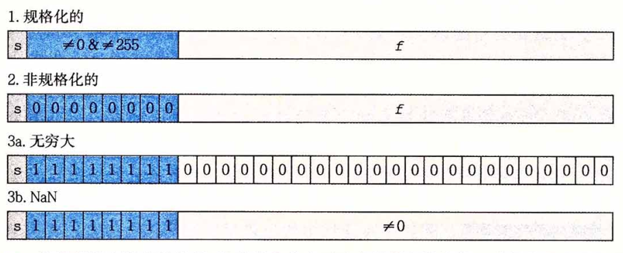

# 第三章 程序的机器级表示
## 程序编码
* 机器级代码，例子：[code](./code/chapter3/Makefile)
  * 汇编与目标代码
    * `objdump -d mstore.o`可以获得汇编代码与机器代码的对应关系
    * `gdb mstore.o` and `x/14xb multstore`，同样可获得汇编代码`multstore`对应的机器代码
  * 反汇编可执行文件
    * `objdump -d main`可以反汇编出可执行文件的汇编代码，与目标文件的反汇编代码的不同之处在于：
      * 左边列出的地址不同
      * `callq`指令填上了调用函数`mult2`需要的地址
  * 汇编文件`mstore.s`
    * 以`.`开头的语句都是伪指令，可忽略
## 汇编语法
* 16个64位主寄存器
  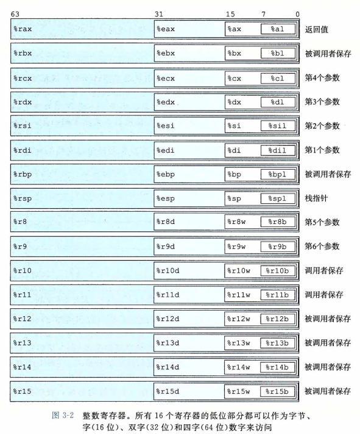
* 操作数(汇编代码的数据源)指示符
  * 立即数(immediate)，表示常数，如：`$0x1F`
  * 寄存器(register)，表示某个寄存器的内容，`R[r]`
  * 内存引用，`M[Addr]`
* 数据传送指令
  * 不支持内存到内存移动，这个要两条指令实现

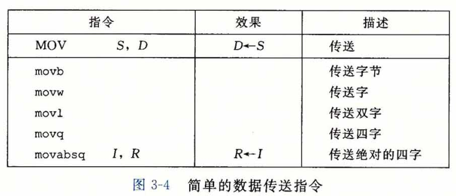
## 函数的调用过程
* 运行时栈
  * 如果函数参数个数比较少，可以直接用寄存器存储，不需要入栈
  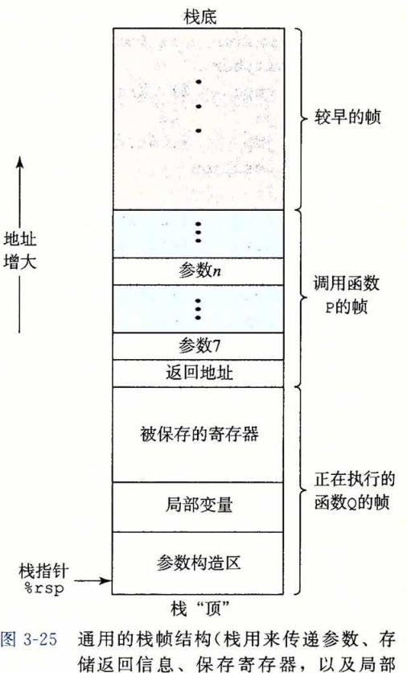

# 第四章 处理器体系结构
## Y86-64指令集体系结构
* 程序员可见的状态 
  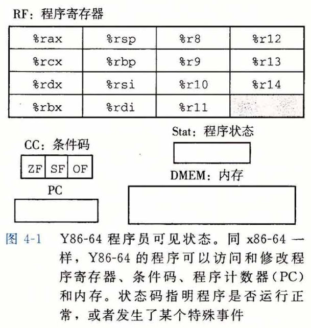
## 逻辑设计和硬件控制语言HCL
* 组合电路的限制 
  * 每个逻辑门的输入必须连接到：1)一个系统输入（主输入），2)某个存储单元的输出，3)某个逻辑门的输出。
  * 两个或多个逻辑门的输出不能连接在一起。
  * 这个网必须是无环的。
* 组合电路和HCL布尔表达式
* 字级的组合电路和HCL整数表达式
  * 通过复杂的逻辑门可以组成更大的网。通常，我们会设计能对数据字（word）进行操作的电路。
* 存储器和时钟
  * D触发器
## Y86-64的顺序实现SEQ
* 将处理组织成阶段
  * 取指(fetch)，从内存中(程序计数器PC的值)取出指令字节
  * 译码(decode)，从寄存器读入操作数
  * 执行(execute)
  * 访存(memory)，数据(内存)的读入或写出
  * 写回(write back)，写回寄存器
  * 更新PC
* SEQ硬件结构
  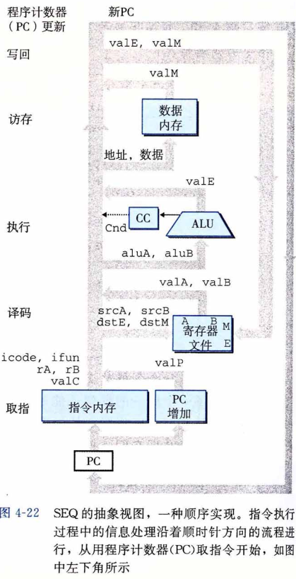
  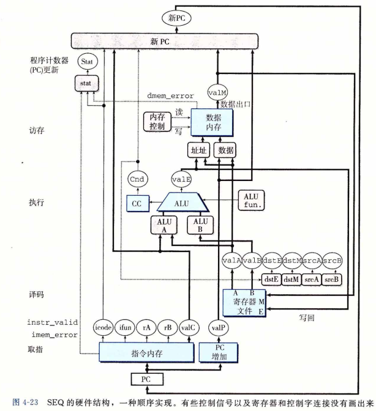
  * 白色方框表示时钟寄存器
  * 蓝色方框表示硬件单元
  * 灰色圆角矩形表示控制逻辑块
  * 白色圆圈表示线路的名称
* SEQ时序
  * SEQ实现包括
    * 组合逻辑
    * 两种存储设备
      * 时钟寄存器（程序计数器和条件码寄存器）
      * 随机访问存储器（寄存器文件，指令内存，数据内存）
  * 原则：从不回读 
  处理器从来不需要为了完成一条指令的执行而去读由该指令更新了的状态
## 流水线的通用原理
重要特性：提高系统的吞吐量(throughput)，也就是单位时间内完成任务的总数，不过也会轻微增加延时(latency)，也就是完成一个任务所需要的时间。
* 流水线的局限性
  * 不一致的划分
  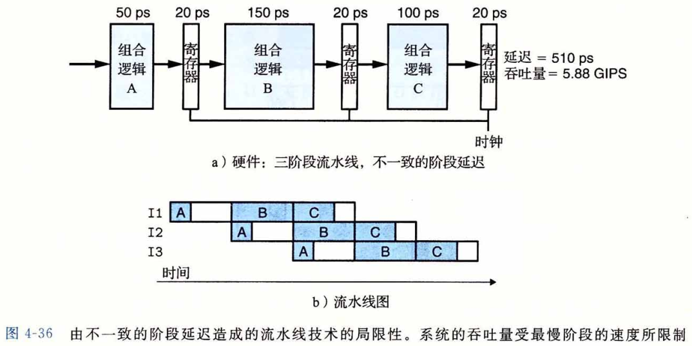
  * 流水线过深，收益反而下降
## Y86-64的流水线实现SEQ+
和顺序实现相比，需要使得更新PC阶段在下一个时钟周期开始时执行，而不是结束时才执行。

# 第五章 优化程序性能
## 常见优化方式
* 调整编译器优化等级
* 消除循环中的低效性，例如：不在循环判断条件中调用函数
* 消除不必要的内存引用，例如：用局部变量存储数据
## 现代微处理器
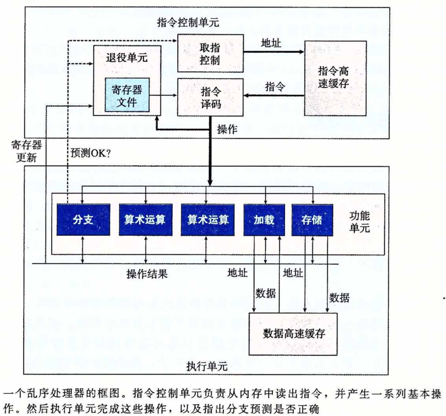
* 指令控制单元(ICU, Instruction Control Unit)
  * 从内存中读取指令序列
* 执行单元(EU, Execution Unit)
  * 执行操作
