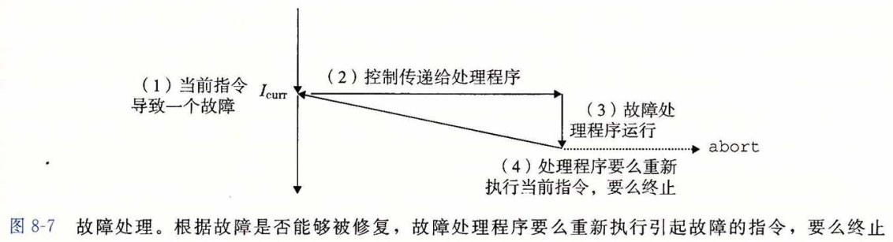
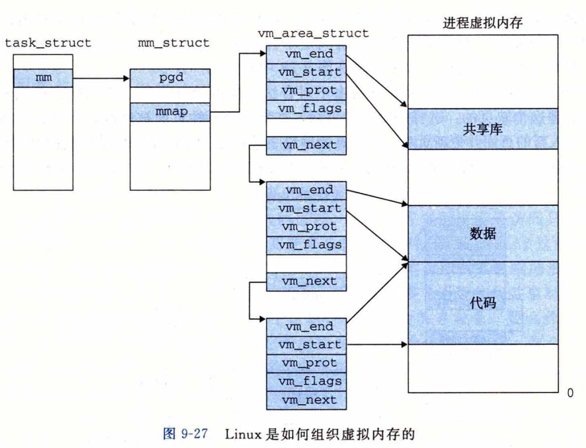

<!-- TOC -->

- [第一章 计算机系统漫游](#第一章-计算机系统漫游)
    - [hello world程序](#hello-world程序)
- [第二章 信息的表示和处理](#第二章-信息的表示和处理)
    - [信息存储](#信息存储)
- [第三章 程序的机器级表示](#第三章-程序的机器级表示)
    - [程序编码](#程序编码)
    - [汇编语法](#汇编语法)
    - [函数的调用过程](#函数的调用过程)
- [第四章 处理器体系结构](#第四章-处理器体系结构)
    - [Y86-64指令集体系结构](#y86-64指令集体系结构)
        - [程序员可见的状态](#程序员可见的状态)
        - [Y86-64指令](#y86-64指令)
        - [指令编码](#指令编码)
        - [Y86-64异常](#y86-64异常)
        - [一个汇编程序的组成](#一个汇编程序的组成)
    - [逻辑设计和硬件控制语言HCL](#逻辑设计和硬件控制语言hcl)
    - [Y86-64的顺序实现SEQ](#y86-64的顺序实现seq)
        - [SEQ硬件结构](#seq硬件结构)
        - [SEQ时序](#seq时序)
        - [SEQ阶段的实现](#seq阶段的实现)
    - [流水线的通用原理](#流水线的通用原理)
        - [流水线的局限性](#流水线的局限性)
        - [带反馈的流水线系统](#带反馈的流水线系统)
    - [Y86-64的流水线实现](#y86-64的流水线实现)
        - [SEQ+: 重新安排计算阶段](#seq-重新安排计算阶段)
        - [插入流水线寄存器](#插入流水线寄存器)
        - [预测下一个PC](#预测下一个pc)
- [第五章 优化程序性能](#第五章-优化程序性能)
    - [常见优化方式](#常见优化方式)
    - [现代微处理器](#现代微处理器)
- [第六章 存储器层次结构](#第六章-存储器层次结构)
    - [存储技术](#存储技术)
    - [局部性](#局部性)
- [第七章 链接](#第七章-链接)
    - [编译驱动程序](#编译驱动程序)
    - [静态链接](#静态链接)
    - [目标文件](#目标文件)
    - [可重定位目标文件](#可重定位目标文件)
    - [符号和符号表](#符号和符号表)
        - [static属性](#static属性)
        - [符号的意义](#符号的意义)
            - [`readelf` 例子](#readelf-例子)
    - [符号解析](#符号解析)
        - [链接器如何解析多重定义的全局符号](#链接器如何解析多重定义的全局符号)
        - [与静态库链接](#与静态库链接)
        - [链接器如何使用静态库来解析引用](#链接器如何使用静态库来解析引用)
    - [重定位](#重定位)
        - [重定位条目](#重定位条目)
        - [重定位符号引用](#重定位符号引用)
    - [可执行目标文件](#可执行目标文件)
    - [加载可执行目标文件](#加载可执行目标文件)
    - [动态链接共享库](#动态链接共享库)
    - [从应用程序中加载和链接共享库](#从应用程序中加载和链接共享库)
    - [位置无关代码](#位置无关代码)
        - [PIC数据引用](#pic数据引用)
        - [PIC函数调用](#pic函数调用)
    - [库打桩机制 library interpositioning](#库打桩机制-library-interpositioning)
    - [处理目标文件的工具](#处理目标文件的工具)
- [第八章 异常控制流](#第八章-异常控制流)
    - [异常](#异常)
        - [异常处理](#异常处理)
        - [中断](#中断)
        - [陷阱和系统调用](#陷阱和系统调用)
        - [故障和终止](#故障和终止)
        - [Linux/x86-64系统中的异常](#linuxx86-64系统中的异常)
    - [进程](#进程)
        - [进程地址空间](#进程地址空间)
        - [用户模式和内核模式](#用户模式和内核模式)
        - [上下文切换](#上下文切换)
    - [信号](#信号)
        - [信号术语](#信号术语)
- [第九章 虚拟内存](#第九章-虚拟内存)
    - [物理和虚拟寻址](#物理和虚拟寻址)
    - [虚拟内存作为缓存的工具](#虚拟内存作为缓存的工具)
        - [页表](#页表)
    - [Linux虚拟内存系统](#linux虚拟内存系统)
        - [Linux虚拟内存组织结构](#linux虚拟内存组织结构)
        - [Linux缺页异常处理](#linux缺页异常处理)
    - [内存映射](#内存映射)
        - [再看共享对象](#再看共享对象)
        - [再看fork函数](#再看fork函数)
        - [再看execve函数](#再看execve函数)

<!-- /TOC -->

# 第一章 计算机系统漫游
## hello world程序
* 编译系统 [code](./code/chapter1/Makefile)
    * 预处理器
    * 编译器
    * 汇编器
    * 链接器


* 计算机系统中的抽象
    * 文件是对IO设备的抽象
    * 虚拟内存是对主存和磁盘IO设备的抽象
    * 进程是对处理器，主存和IO设备的抽象，是对正在运行的程序的抽象


# 第二章 信息的表示和处理
## 信息存储
* 字节(byte)、字(word)和字长(word size)
    * 字节，8位的块，最小的可寻址的内存单位
    * 虚拟地址以字来编码，所以字长决定了虚拟地址空间的最大大小。每台计算机都有一个字长，指明指针的长度。 对于一个字长为w位的机器，虚拟地址范围为(0 ~ 2^w - 1)
    * 例子: [code](./code/chapter2/size/main.cpp)
* 整数表示
    * 无符号数，最高位权重是1
    * 有符号数，最高位权重是-1
    * 有符号数和无符号数运算，C语言默认将两个数都视作非负的无符号数。例子：[code](./code/chapter2/main.cpp)
* 小数表示
    * 定点表示法：二进制小数
    * 浮点表示法：符号，尾数，阶码
    

# 第三章 程序的机器级表示
## 程序编码
* 机器级代码，例子：[code](./code/chapter3/Makefile)
    * 汇编与目标代码
        * `objdump -d mstore.o`可以获得汇编代码与机器代码的对应关系
        * `gdb mstore.o` and `x/14xb multstore`，同样可获得汇编代码`multstore`对应的机器代码
    * 反汇编可执行文件
        * `objdump -d main`可以反汇编出可执行文件的汇编代码，与目标文件的反汇编代码的不同之处在于：
            * 左边列出的地址不同
            * `callq`指令填上了调用函数`mult2`需要的地址
    * 汇编文件`mstore.s`
        * 以`.`开头的语句都是伪指令，可忽略
## 汇编语法
* 16个64位主寄存器<br>

* 操作数(汇编代码的数据源)指示符
    * 立即数(immediate)，表示常数，如：`$0x1F`
    * 寄存器(register)，表示某个寄存器的内容，`R[r]`
    * 内存引用，`M[Addr]`
    
* 数据传送指令<br>

    * 不支持内存到内存移动，这个要两条指令实现
    * examples
    
* 压入和弹出栈数据<br>

    * example for `pushq %rax` and `popq %rdx`
    
* 算术和逻辑操作<br>
四组操作：
    * 加载有效地址: 从内存读数据到寄存器(movq的变形)
    * 一元操作
    * 二元操作
    * 移位
    
* 条件码<br>


## 函数的调用过程
* 运行时栈
    * 如果函数参数个数比较少，可以直接用寄存器存储，不需要入栈<br>
    

# 第四章 处理器体系结构
## Y86-64指令集体系结构
一个指令集包括：
* 各种状态单元
* 指令集
* 指令编码
* 异常事件处理

### 程序员可见的状态
* 什么是程序员可见状态？
    * 每条指令都会读写处理器状态的某些部分，这些部分是对编译器可见的状态，称为程序员可见状态
* 可见状态有：
    * 寄存器
        * 存储一个64位的字
    * 条件码
        * 保存着最近的算术或逻辑指令所造成影响的有关信息
    * 程序计数器
        * 存放当前正则执行指令的地址
    * 内存
        * 保存程序和数据
    * 状态码
        * 表明程序执行的总体状态，是否存在异常


### Y86-64指令

* move指令
    * `movq [src] [dest]`
        * src可以是
            * 立即数(i)
            * 寄存器(r)
            * 内存(m)
        * dest可以是
            * 寄存器(r)
            * 内存(m)
* 运算(Op)指令
    * 支持四种运算：add, sub, and, xor
    * 会修改条件码
* 跳转指令
    * 根据条件码跳转
* 条件move指令
    * 根据条件码在寄存器之间传送
* 栈相关指令
    * call/ret
    * pushq/popq

### 指令编码
* 指令第一个字节
    * 表明指令的类型，由两部分组成：
        * 高4位是代码(code)部分
        * 低4位是功能(function)部分
* 寄存器由0x0~0xF数字编码，占4bits<br>
    
* 以`rmmovq`指令为例，`rmmovq %rsp, 0x123456789abcd(%rdx)`的编码为：
    * `4042_cdab_8967_4523_0100`
        * 40代表`rmmovq`指令
        * 4代表%rsp寄存器
        * 2代表%rdx寄存器
        * 后面8-bytes是小端表示的立即数`0x0001_2345_6789_abcd`

### Y86-64异常

* 比较完美的设计中，当发生异常时，处理器会调用一个异常处理程序
    * 例如，中止程序或者调用一个用户自定义的信号处理程序(signal handler)

### 一个汇编程序的组成
* 一个简单的汇编程序一般由以下几步组成：
  * 最开始先设置栈
    ```bash
    # Execution begins at address 0
        .pos 0
        irmovq stack, %rsp  # Set up stack pointer %rsp with immediate number
        call main           # Execute main program
        halt                # Terminate program
    ```
  * 进入主函数main后，开始初始化数据
    ```bash
    # Array of 4 elements
      .align 8              # 汇编伪指令
    array:
      .quad ...
    main:
      irmovq array, %rdi    # initialize %rdi register for data0
      irmovq $4, %rsi       # initialize %rsi register for data1
      call sum              # call sum
      ret
    ```
  * 准备好数据后，进入处理函数执行
    ```bash
    # long sum(long* start, long count)
    # start in %rdi, count in %rsi
    sum:
      irmovq $8,%r8         # local data constant 8
      irmovq $1,%r9         # local data constant 1
      xorq %rax,%rax        # %rax is for sum, sum = 0
      andq %rsi,%rsi        # %rsi is count, if count == 0, exit the function. CC is set here
    loop:
      mrmovq (%rdi),%r10    # move data from register %rdi (start) to %r10 register
      addq %r10,%rax        # add to result sum
      addq %r8,%rdi         # start++
      subq %r9,%rsi         # count-- and set CC
    test:
      jne loop              # stop when 0
      ret
    ```
  * 最后指定stack位置
    ```bash
    # Stack starts here and grows to lower addresses
      .pos 0x200
    stack:
    ```

## 逻辑设计和硬件控制语言HCL
* 组合电路的限制<br>
    * 每个逻辑门的输入必须连接到：1)一个系统输入（主输入），2)某个存储单元的输出，3)某个逻辑门的输出。
    * 两个或多个逻辑门的输出不能连接在一起。
    * 这个网必须是无环的。
* 组合电路和HCL布尔表达式
* 字级的组合电路和HCL整数表达式
    * 通过复杂的逻辑门可以组成更大的网。通常，我们会设计能对数据字（word）进行操作的电路。
* 存储器和时钟
    * 时钟寄存器存储单个位或字
        * 时钟信号控制寄存器加载输入值，如：D触发器。不同于我们常见的程序寄存器(寄存器文件是随机访问存储器)，这里的寄存器是硬件寄存器，是组合电路的屏障，如下图：<br>
        
    * 随机访问存储器(简称内存)存储多个字
        * 用地址来选择该读或该写哪个字，包括两类：
            * 处理器的虚拟内存系统<br>
            
            * 寄存器文件<br>
            

## Y86-64的顺序实现SEQ
* 将处理组织成阶段
    * 取指(fetch)，从内存中(程序计数器PC的值)取出指令字节
        * 指令代码(icode)
        * 指令功能(ifun)
    * 译码(decode)，从寄存器读入最多两个操作数
    * 执行(execute)，计算得到值valE
        * 要么执行指令指明的操作，计算内存引用的有效地址。检验条件码和传送条件，更新目标寄存器
        * 要么增加或减少栈指针
    * 访存(memory)，数据(内存)的读入或写出
    * 写回(write back)，写回寄存器
        * 最多可以写两个结果到寄存器文件
    * 更新PC


### SEQ硬件结构

* 取指
    * 根据PC作为内存地址，从内存中读取指令
    * 根据PC计算valP
* 译码
    * 从寄存器文件读取valA和valB
* 执行
    * 根据指令类型，将ALU用于以下不同目的：
        * 整数操作运算
        * 作为一个加法器来计算增加或减少栈指针
        * 计算有效地址
        * 简单地加0，将一个输入传递到输出
    * ALU还赋值计算条件码的新值
* 访存
    * 读写内存
* 写回
    * 写寄存器文件
        * 端口E用来写ALU计算出来的值
        * 端口M用来写从内存中读出的值
* PC更新
    * valP，下一条指令的地址
    * valC，调用指令或跳转指令指定的目标地址
    * valM，从内存读取的返回地址


* 白色方框表示时钟寄存器
    * PC是SEQ中唯一的时钟寄存器，由**时钟信号**控制寄存器加载输入值
* 蓝色方框表示硬件单元
* 灰色圆角矩形表示控制逻辑块
    * 用来从一组信号源中进行选择，或者用来计算一些布尔函数
* 白色圆圈表示线路的名称
* 线的粗细代表了上面传输数据的宽度
    * 单个位的连接用虚线来表示

### SEQ时序
SEQ实现包括
* 组合逻辑
* 两种存储设备
    * 时钟寄存器（程序计数器和条件码寄存器）
    * 随机访问存储器（寄存器文件，指令内存，数据内存）
        * 指令内存只用来读指令，因此我们可以将这个单元看成是组合逻辑

组合逻辑不需要任何时序或控制--只要输入变化了，值就通过逻辑门网络传播。我们也将读随机访问存储器看成和组合逻辑一样的操作，根据地址输入产生输出字。那么我们由四个硬件单元需要对它们的时序进行明确的控制。这些单元通过一个时钟信号控制，它触发将新值装载到寄存器以及将值写到随机访问存储器。
* 程序计数器
    * 每个时钟周期，都会装载新的指令地址
* 条件码寄存器
    * 只有在执行整数运算指令时，才会装载条件码寄存器
* 数据内存
    * 只有在执行`rmmovq`, `pushq`, `call`指令时，才会写数据内存
* 寄存器文件
    * 两个写端口运行每个时钟周期更新两个程序寄存器，我们可以用特殊的寄存器ID0xF作为端口地址，来表明此端口不应该执行写操作

要控制处理器中活动的时序，只需要寄存器和内存的时钟控制。即使所有的状态更新实际上同时发生，也能保证赋值顺序执行的效果。原因时我们遵循以下原则组织计算：
* 原则：从不回读
    * 处理器从来不需要为了完成一条指令的执行而去读由该指令更新了的状态，这样保证了在一个指令中不会出来前后依赖
    * 例如，有些指令(整数运算)会设置条件码，有些指令(跳转指令)会读取条件码，但没有指令必须既设置又读取条件码


* 在周期3开始的时候，状态单元保持的时第二条`irmovq`指令更新过的状态(上图1中的浅灰色)
* 在周期3的末尾，组合逻辑位条件码产生了新的值(000)，程序寄存器%rbx的更新值，以及程序计数器是新值(0x016)，但是状态单元还未更新
* 当时钟上升周期4时，会更新程序计数器、寄存器文件和条件码寄存器(上图3中的蓝色)

### SEQ阶段的实现
本节会设计实现SEQ所需要的控制逻辑块的HCL描述。
* 取指阶段<br>
    
    * 以PC作为第一个字节的地址，从内存读出10个字节。第一个字节被解释成：icode+ifun
        * need_regids: 这个指令是否包括一个寄存器指示符字节
            * HCL描述：`bool need_regids = icode in { IRRMOVQ, IOPQ, IPUSHQ, IPOPQ, IIRMOVQ, IRMMOVQ, IMRMOVQ};`
        * need_valC: 这个指令是否包括一个常数字
    * "Align"硬件单元会处理剩下9个字节，将它们放入寄存器字段和常数字中
        * 当need_regids为1时，字节1被分开装入寄存器指示符rA和rB中。否则，这个字段会被设为0xF(RNONE)
        * 根据信号need_regids的值，选择字节1~8或2~9产生valC
    * PC增加器根据PC值p，need_regids值r以及need_valC值i，增加其产生值`p+1+r+8i`
* 译码和写回阶段<br>
    
    * 这两个阶段都要访问寄存器文件
    * 寄存器ID srcA表明应该读哪个寄存器以产生valA
        * srcA的HCL描述，其中RRSP是%rsp的寄存器ID
        ```sh
        word srcA = [
            icode in { IRRMOVQ, IRMMOVQ, IOPQ, IPUSHQ } : rA;
            icode in { IPOPQ, IRET } : RRSP;
            1 ： RNONE； # Don't need register
        ];
        ```
    * 寄存器ID dstE表明写端口E的目的寄存器，计算出来的valE将放在那里
        * dstE的HCL描述
        ```sh
        # WARNING: Conditional move not implemented correctly here
        word dstE = [
            icode in { IRRMOVQ } : rB;
            icode in { IIRMOVQ, IOPQ } : rB;
            icode in { IPUSHQ, IPOPQ, ICALL, IRET } : RRSP;
            1 : RNONE;
        ];
        ```
* 执行阶段<br>
    
    * alufun信号可以是：ADD, SUBTRACT, AND或EXCLUSIVE-OR，其HCL描述如下：
    ```sh
    word alufun = [
        icode == IOPQ : ifun;
        1 : ALUADD;
    ];
    ```
    * aluA的值可以是valA, valC, 或者是-8或+8，其HCL描述如下：
    ```sh
    word aluA = [
        icode in { IRRMOVQ, IOPQ } : valA;
        icode in { IIRMOVQ, IRMMOVQ, IMRMOVQ } : valC;
        icode in { ICALL, IPUSHQ } : -8;
        icode in { IRET, IPOPQ } : 8;
    ];
    ```
    * ALU每次运行都会产生三个与条件码相关的信号--零、符号和溢出
        * `bool set_cc = icode in { IOPQ };`
    * cond硬件单元会根据条件码和功能码来确定是否进行条件分支或者条件数据传送
* 访存阶段<br>
    
    * 此阶段的任务就是读或者写数据内存
    * 两个控制块产生内存地址和内存输入数据
        * mem_addr的HCL描述
        ```sh
        word mem_addr = [
            icode in { IRMMOVQ, IPUSHQ, ICALL, IMRMOVQ } : valE;
            icode in { IPOPQ, IRET } : valA;
        ];
        ```
    * 另外两个块产生表明应该执行读操作还是写操作的控制信号。当执行读操作时，数据内存产生值valM
        * mem_read的HCL描述: `bool mem_read = icode in { IMRMOVQ, IPOPQ, IRET };`
* 更新PC阶段<br>
    
    * 新的PC可能是valC, valM或valP
    ```sh
    word new_pc = [
        icode == ICALL : valC;
        # Taken branch
        icode == IJXX && Cnd : valC;
        icode == IRET : valM;
        1 : valP;
    ];
    ```

## 流水线的通用原理
重要特性：提高系统的吞吐量(throughput)，也就是单位时间内完成任务的总数，不过也会轻微增加延时(latency)，也就是完成一个任务所需要的时间。

### 流水线的局限性
* 不一致的划分<br>

* 流水线过深，收益反而下降

### 带反馈的流水线系统

* 上图中的pipeline改变了系统的行为，是不可接受的。必须正确处理：
    * 数据相关
        * 指令之间有数据传递
    * 控制相关
        * 有控制语句，会根据其他指令的结果执行不同的过程

## Y86-64的流水线实现

### SEQ+: 重新安排计算阶段
和顺序实现相比，需要使得更新PC阶段在下一个时钟周期开始时执行，而不是结束时才执行。


* 上图a中，PC计算发生在时钟周期结束的时候，根据当前时钟周期内计算出的信号值来计算PC寄存器的新值
* 上图b中，创建了状态寄存器来保存一条指令执行过程中计算出来的信号。然后当一个新的时钟周期开始时，这些信号值通过同样的逻辑来计算当前指令的PC。如：“pIcode”, "pCnd"指明在任一给定的周期，它们保存的时前一个周期中产生的控制信号


### 插入流水线寄存器
在SEQ+的各个阶段之间插入流水线寄存器，得到PIPE-结构，其中白色的方框表示实际的硬件组成：<br>


上图包括以下阶段：
* F 保存程序计数器的预测值
* D 取指和译码阶段之间，保存最新取出的指令信息
* E 译码和执行阶段之间，保存最新译码的指令和从寄存器文件读出的值
* M 执行和访存阶段之间，保存最新执行的指令的结果，以及处理条件转移到分支条件和分支目标
* W 访存和反馈路径之间，反馈路径将计算出来的值提供给寄存器文件写，而当完成ret指令时，它还要像PC选择逻辑提供返回地址


### 预测下一个PC


# 第五章 优化程序性能
## 常见优化方式
* 调整编译器优化等级
* 消除循环中的低效性，例如：不在循环判断条件中调用函数
* 消除不必要的内存引用，例如：用局部变量存储数据
## 现代微处理器

* 指令控制单元(ICU, Instruction Control Unit)
    * 从内存中读取指令序列
* 执行单元(EU, Execution Unit)
    * 执行操作

# 第六章 存储器层次结构
提高程序局部性，可以提升程序性能。因为不同层次的存储器，访问时间差别是巨大的：
* CPU寄存器：0周期
* 高速缓存：4~75个周期
* 主存：上百个周期
* 磁盘：几千万个周期
## 存储技术
* 随机访问存储器(RAM)
    * 静态(SRAM)
        * 用于高速缓存存储器，既可以在CPU上，也可以在片下
    * 动态(DRAM)
        * 对干扰非常敏感，需要刷新
        * 使用纠错码纠错
        * 64位内存模块
        
* 非易失性存储器(nonvolatile memory)
断电后不丢失信息(不同于RAM)。存储在ROM设备中的程序通常被称为固件(firmware)。
    * PROM: 只能编程一次
    * EEPROM：可擦写可编程
    * flash memory
* 磁盘存储
* 固态硬盘 SSD
## 局部性
* 重复引用相同变量，有好的时间局部性
* 步长越小，空间局部性越好，例如，二维数组遍历先行后列

# 第七章 链接
## 编译驱动程序
* [demo](./code/chapter7/link)
* 相似的代码可参考第一章的代码[例子](./code/chapter1)
## 静态链接
为了构造可执行文件，链接器必须完成：
* 符号解析(symbol resolution)，将每个符号引用和定义关联
* 重定位(relocation)，将符号定义和内存位置关联起来
## 目标文件
目标文件有三种形式：
* 可重定位目标文件<br>
二进制代码和数据(.o 文件，.a文件)，与其他可重定位目标文件合并创建一个可执行目标文件，可由编译器和汇编器生成
* 可执行目标文件<br>
可直接复制到内存并执行(.out 文件)
* 共享目标文件<br>
一种特殊的可重定位目标文件(.so文件)，可以在加载或者运行时被动态地加载进内存并链接(链接库)，可由编译器和汇编器生成

目标文件的格式：
* Windows：Portable Executable, PE
* Mac: Mach-O
* Linux: Executable and Linkable Format, ELF

## 可重定位目标文件

* ELF header
    * 描述系统信息，字的大小和字节顺序
    * 帮助链接器语法分析的信息：ELF头的大小，目标文件的类型(三种)
* .text
    * 已编译程序的机器代码
* .rodata
    * 只读数据，比如printf语句中的格式串和开关语句的跳转表
* .data
    * 已初始化的全局和静态C变量。局部C变量在运行时被保存在栈中，既不出现在.data节中，也不出现在.bss节中。
* .bss
    * 未初始化的全局和静态C变量，以及所有被初始化为0的全局或静态变量。在目标文件中这个节不占据实际的空间，它仅仅是一个占位符。目标文件格式区分已经初始化和未初始化变量是为了空间效率。在目标文件中，未初始化变量不需要占据任何实际的磁盘空间。运行时，在内存中分配这些变量，初始值为0。
* .symtab
  * 一个符号表，它存放在程序中定义和引用的函数和全局变量的信息。一些程序员错误地认为必须通过-g选项来编译一个程序，才能得到符号表信息。实际上，每个可重定位目标文件在.symtab中都有一张符号表(除非程序员特意用STRIP命令去掉它)。然而，和编译器中的符号表不同，.symtab符号表不包含局部变量的条目。
  * `-g` enables use of extra debugging information, e.g. line number.
    * [sum.c](./code/chapter7/link/sum.c)无`-g`的symbol table如下：
    ```
    sum2.o:     file format elf64-x86-64

    SYMBOL TABLE:
    0000000000000000 l    df *ABS*  0000000000000000 sum.i
    0000000000000000 l    d  .text  0000000000000000 .text
    0000000000000000 l    d  .data  0000000000000000 .data
    0000000000000000 l    d  .bss   0000000000000000 .bss
    0000000000000000 l    d  .note.GNU-stack        0000000000000000 .note.GNU-stack
    0000000000000000 l    d  .eh_frame      0000000000000000 .eh_frame
    0000000000000000 l    d  .comment       0000000000000000 .comment
    0000000000000000 g     F .text  0000000000000045 sum
    ```
    * [sum.c](./code/chapter7/link/sum.c)有`-g`的symbol table如下：
    ```
    sum.o:     file format elf64-x86-64

    SYMBOL TABLE:
    0000000000000000 l    df *ABS*  0000000000000000 sum.i
    0000000000000000 l    d  .text  0000000000000000 .text
    0000000000000000 l    d  .data  0000000000000000 .data
    0000000000000000 l    d  .bss   0000000000000000 .bss
    0000000000000000 l    d  .debug_info    0000000000000000 .debug_info
    0000000000000000 l    d  .debug_abbrev  0000000000000000 .debug_abbrev
    0000000000000000 l    d  .debug_aranges 0000000000000000 .debug_aranges
    0000000000000000 l    d  .debug_line    0000000000000000 .debug_line
    0000000000000000 l    d  .debug_str     0000000000000000 .debug_str
    0000000000000000 l    d  .note.GNU-stack        0000000000000000 .note.GNU-stack
    0000000000000000 l    d  .eh_frame      0000000000000000 .eh_frame
    0000000000000000 l    d  .comment       0000000000000000 .comment
    0000000000000000 g     F .text  0000000000000045 sum
    ```
  * 上述符号表各列的意义
  ```
  COLUMN ONE: the symbol's value
  COLUMN TWO: a set of characters and spaces indicating the flag bits that are set on the symbol. There are seven groupings which are listed below:
    group one: (l,g,,!) local, global, neither, both.
    group two: (w,) weak or strong symbol.
    group three: (C,) symbol denotes a constructor or an ordinary symbol.
    group four: (W,) symbol is warning or normal symbol.
    group five: (I,) indirect reference to another symbol or normal symbol.
    group six: (d,D,) debugging symbol, dynamic symbol or normal symbol.
    group seven: (F,f,O,) symbol is the name of function, file, object or normal symbol.
  COLUMN THREE: the section in which the symbol lives, ABS means not associated with a certain section
  COLUMN FOUR: the symbol's size or alignment.
  COLUMN FIVE: the symbol's name.
  ```
* .rel.text
    * 一个.text节中位置的列表，当链接器把这个目标文件和其他文件组合时，需要修改这些位置。一般而言，任何调用外部函数或者引用全局变量的指令都需要修改。另一方面，调用本地函数的指令则不需要修改。注意，可执行目标文件中并不需要重定位信息，因此通常省略。
* rel.data
    * 被模块引用或定义的所有全局变量的重定位信息。一般而言，任何已初始化的全局变量，如果它的初始值是一个全局变量地址或者外部定义函数的地址，都需要被修改。
* .debug
    * 一个调式符号表，其条目是程序中定义的局部变量和类型定义，程序中定义和引用的全局变量。
* .strtab
    * 一个字符串表，其内容包括.symtab和.debug节中的符号表，以及节头部中的节名字。字符串表就是以null结尾的字符串的序列。

## 符号和符号表
三种不同的符号：
* 由此模块定义并能被其他模块引用的全局符号，如：非静态的C函数和全局变量
* 由其他模块定义并被此模块引用的全局符号(外部符号)
* 只被此模块定义和引用的局部符号，对应于带`static`属性的C函数和全局变量。

**注意**：.symtab中的符号表不包含对应于本地非静态程序变量的任何符号，这些符号在运行时在栈中被管理，链接器对此类符号不感兴趣。

### static属性
```c
int f()
{
    static int x = 0;
    return x;
}

int g()
{
    static int x = 1;
    return x;
}
```
编译器在.data或.bss中为每个定义分配空间，并在符号表中创建一个唯一的名字。如上面的例子中，编译器会向汇编器输出两个不同名字的局部链接器符号，可以用`x.1`表示函数f中的定义，而用`x.2`表示函数g中的定义。

### 符号的意义
每个符号都被分配到目标文件的某个节，由`section`字段表示(如：.text等)。有三个特殊的伪节*(pseudosection)，它们在节头部表中没有条目：
* ABS: 代表不该被重定位的符号
* UNDEF：代表未定义的符号，也就是在本目标模块中引用，但是却在其他地方定义的符号
* COMMON：表示还未被分配位置的未初始化的数据目标。对于COMMON符号，value字段给出对齐要求，而size给出最小的大小
    * COMMON和.bss的区别
        * COMMON: 未初始化的全局变量
        * .bss: 未初始化的静态变量，以及初始化为0的全局或静态变量
#### `readelf` 例子
`readelf -a main.o`命令可得到下面三行：
```
13: 0000000000000000     8 OBJECT  GLOBAL DEFAULT    3 array
14: 0000000000000000    35 FUNC    GLOBAL DEFAULT    1 main
16: 0000000000000000     0 NOTYPE  GLOBAL DEFAULT  UND sum
```
`objdump -t main.o`命令可得到如下三行：
```
0000000000000000 g     O .data  0000000000000008 array
0000000000000000 g     F .text  0000000000000023 main
0000000000000000         *UND*  0000000000000000 sum
```
* main条目<br>
它是一个位于`.text`节中偏移量为0(即value值)处的35字节函数。
* array条目<br>
它是一个位于`.data`节中偏移量为0处的8字节目标。
* sum条目<br>
它是一个对外部符号`sum`的引用。READELF用一个整数索引来标识每个节。 Ndx=1表示.text节，而Ndx=3表示.data节。

## 符号解析
链接器解析符号引用的方法是将每个引用与它输入的可重定位目标文件的符号表中的一个确定的符号定义关联起来。
* 全局符号的引用解析<br>
当编译器遇到一个不是在当前模块中定义的符号(变量或函数名)时，会假设该符号是在其他某个模块中定义的，生成一个链接器符号表条目，并把它交给链接器处理。如果链接器在它的任何输入模块中都找不到这个被引用符号的定义，就输出一条错误信息并终止。

### 链接器如何解析多重定义的全局符号
在编译时，编译器向汇编器输出每个全局符号，或者是强(strong)或者是弱(weak)，而汇编器把这个信息隐含地编码在可重定位目标文件的符号表里。
* 函数和已初始化的全局变量是强符号
* 未初始化的全局变量是弱符号

Linux链接器使用下面的规则来处理多重定义的符号名，可参考[例子](./code/chapter7/symbol_conflict)：
* 规则1：不允许有多个同名的强符号
* 规则2：如果有一个强符号和多个弱符号同名，那么选择强符号
* 规则3：如果有多个弱符号同名，那么从这些弱符号中任意选择一个

### 与静态库链接


上图显示了[例子](./code/chapter7/static_lib)的编译过程。链接器只会从静态库中提取需要链接的目标文件(`addvec.o`)，不会把所有的目标文件都链接进可执行文件。

### 链接器如何使用静态库来解析引用
从左到有解析，一般把静态库放到后面。有时候会出现需要写两遍静态库的情况, 如, `libx.a`和`liby.a`相互调用的情况：
`gcc foo.c libx.a liby.a libx.a`

## 重定位
重定位的目的是：为每个符号分配运行时地址。由两步组成：
* 重定位节和符号定义
    * 将所有输入模块的相同类型的节合并为同一类型的新的聚合节
    * 将运行时内存地址赋给每个节以及每个符号
* 重定位节中的符号引用
    * 修改代码节和数据节中对每个符号的引用，使得它们指向正确的运行时地址

### 重定位条目
由于汇编器无法确定外部引用最终在内存中的位置，所以它就会生成一个重定位条目，告诉链接器在将目标文件合并成可执行文件时如何修改这个引用。重定位条目会告诉链接器需要修改的引用的信息。
* .rel.text: 存放代码的重定位条目
* .rel.data：存放已初始化数据的重定位条目

### 重定位符号引用
* [main.c](./code/chapter7/link/main.c)的重定位前的汇编代码(`objdump -d main.o`)
```
0000000000000000 <main>:
   0:   55                      push   %rbp
   1:   48 89 e5                mov    %rsp,%rbp
   4:   48 83 ec 10             sub    $0x10,%rsp
   8:   be 02 00 00 00          mov    $0x2,%esi
   d:   48 8d 3d 00 00 00 00    lea    0x0(%rip),%rdi        # 14 <main+0x14>
                        10: R_X86_64_PC32       array-0x4
  14:   e8 00 00 00 00          callq  19 <main+0x19>
                        15: R_X86_64_PLT32      sum-0x4
  19:   89 45 fc                mov    %eax,-0x4(%rbp)
  1c:   b8 00 00 00 00          mov    $0x0,%eax
  21:   c9                      leaveq 
  22:   c3                      retq 
```
* [main.c](./code/chapter7/link/main.c)的重定位后的汇编代码(`objdump -D main`)
```
0000000000401000 <main>:
  401000:       55                      push   %rbp
  401001:       48 89 e5                mov    %rsp,%rbp
  401004:       48 83 ec 10             sub    $0x10,%rsp
  401008:       be 02 00 00 00          mov    $0x2,%esi
  40100d:       48 8d 3d ec 2f 00 00    lea    0x2fec(%rip),%rdi        # 404000 <array>
  401014:       e8 0a 00 00 00          callq  401023 <sum>
  401019:       89 45 fc                mov    %eax,-0x4(%rbp)
  40101c:       b8 00 00 00 00          mov    $0x0,%eax
  401021:       c9                      leaveq 
  401022:       c3                      retq
0000000000401023 <sum>:
  401023:       55                      push   %rbp
  ...
0000000000404000 <array>:
  404000:       01 00                   add    %eax,(%rax)
  ...
```

## 可执行目标文件

* 可执行目标文件 ELF header (`readelf -h main`)
```
ELF Header:
  Magic:   7f 45 4c 46 02 01 01 00 00 00 00 00 00 00 00 00 
  Class:                             ELF64
  Data:                              2's complement, little endian
  Version:                           1 (current)
  OS/ABI:                            UNIX - System V
  ABI Version:                       0
  Type:                              EXEC (Executable file)
  Machine:                           Advanced Micro Devices X86-64
  Version:                           0x1
  Entry point address:               0x401000
  Start of program headers:          64 (bytes into file)
  Start of section headers:          13872 (bytes into file)
  Flags:                             0x0
  Size of this header:               64 (bytes)
  Size of program headers:           56 (bytes)
  Number of program headers:         5
  Size of section headers:           64 (bytes)
  Number of section headers:         13
  Section header string table index: 12
```
* 可重定位目标文件 ELF header (`readelf -h main.o`)
```
ELF Header:
  Magic:   7f 45 4c 46 02 01 01 00 00 00 00 00 00 00 00 00 
  Class:                             ELF64
  Data:                              2's complement, little endian
  Version:                           1 (current)
  OS/ABI:                            UNIX - System V
  ABI Version:                       0
  Type:                              REL (Relocatable file)
  Machine:                           Advanced Micro Devices X86-64
  Version:                           0x1
  Entry point address:               0x0
  Start of program headers:          0 (bytes into file)
  Start of section headers:          1744 (bytes into file)
  Flags:                             0x0
  Size of this header:               64 (bytes)
  Size of program headers:           0 (bytes)
  Number of program headers:         0
  Size of section headers:           64 (bytes)
  Number of section headers:         20
  Section header string table index: 19
```
* 可执行目标文件相对于可重定位目标文件的不同之处
    * .init节，定义了一个小函数，叫做_init，程序的初始化代码会调用它。
    * 因为可执行文件是完全链接的(已被重定位)，所以它不再需要.rel节。

## 加载可执行目标文件

如上图所示，每个Linux程序都有一个运行时内存映像，程序运行过程如下：
* 加载器运行，创建如上图所示的内存映像
* 加载器复制可执行文件的内容到代码段和数据段
* 加载器跳转到程序的入口点：`_start`函数地址
* `_start`函数调用系统启动函数`__libc_start_main`，该函数定义在libc.so中
* `__libc_start_main`初始化执行环境，并调用用户层的`main`函数

## 动态链接共享库

不同于静态链接，在创建可执行文件时，链接器(`ld`)只执行部分重定位，然后在程序加载时，由动态链接器(`ld-linux.so`)完成全部重定位过程。

当加载器加载可执行文件时，注意到可执行文件包含`.interp`节，这一节包含动态链接器的路径名。以上图为例，动态链接器执行下面的重定位任务完成链接：
* 重定位`libc.so`的文本和数据到某个内存段
* 重定位`libvector.so`的文本和数据到另一个内存段
* 重定位`prog21`中所有对由`libc.so`和`libvector.so`定义的符号的引用
* 最后，动态链接器将控制传递给应用程序。从这个时刻开始，共享库的位置就固定了，并且在程序执行的过程中都不会改变

## 从应用程序中加载和链接共享库
应用程序除了在编译时指定共享库，也可以在它运行时要求动态链接器加载和链接某个共享库，可参考[例子](./code/chapter7/dynamic_lib/dlmain.c)

## 位置无关代码
问题：多个进程如何共享程序的一个副本，以节约内存资源？<br>
通过一种编译方式共享代码段，使得可以把他们加载到内存的任何位置而无需链接器修改。使用这种方式，无限多个进程可以共享一个共享模块的代码段的单一副本。当然，每个进程仍然会有它自己的读写数据块。
### PIC数据引用
无论我们在内存中的何处加载一个目标模块，数据段与代码段的距离总是保持不变。因此，代码段中任何指令和数据段中的任何变量之间的距离都是一个运行时常量，与代码段和数据段的绝对位置是无关的。<br>
如何生成全局变量PIC引用？
* Global Offset Table (GOT)<br>
以`libvector.so`中的全局变量[addcnt](./code/chapter7/dynamic_lib/addvec.c)函数为例，看`addvec`函数是如何引用全局变量`addcnt`的。

`addvec`例程通过`GOT[3]`间接地加载全局变量`addcnt`的地址，然后把`addcnt`在内存中加1。这里的关键思想是对`GOT[3]`的PC相对引用中的偏移量是一个运行时常量。
### PIC函数调用
如何实现不需要链接器修改调用模块的代码段，实现动态库的PIC函数调用？答案是通过以下两个机制，实现延时绑定(lazy binding)：
* GOT
* 过程链接表(Procedure Linkage Table, PLT)

如果一个目标模块调用定义在共享库中的任何函数，那么它就由自己的GOT和PLT。GOT是数据段的一部分，而PLT是代码段的一部分。那么，GOT和PLT是如何协同工作的呢？

以[main.c](./code/chapter7/dynamic_lib/main.c)调用`libvector.so`中的[addvec](./code/chapter7/dynamic_lib/addvec.c)函数为例：
* 过程链接表(PLT)<br>
每个被可执行程序调用的库函数都有自己的PLT条目。PLT是一个16字节条目的数组。上图中：
    * PLT[0]是一个特殊条目，跳转到动态链接器中
    * PLT[1]调用系统启动函数`__libc_start_main`
    * PLT[2]开始的条目是用户代码调用的函数，其中PLT[2]调用`addvec`
    * PLT[3]调用`printf`
* 全局偏移量表(GOT)<br>
GOT是8字节条目的数组。上图中：
    * GOT[0]和GOT[1]包含动态链接器在解析函数地址时会使用的信息。
    * GOT[2]是动态链接器在`ld-linux.so`模块中的入口点。
    * 其余的每个条目对应于一个被调用的函数，**其地址需要在运行时被解析**。每个条目都有一个相匹配的PLT条目。例如，GOT[4]和PLT[2]对应于`addvec`
下面解释，GOT和PLT是如何工作的？
* `addvec`被第一次调用时，目的是利用动态链接器将`addvec`的运行是地址加载到GOT[4]中(GOT[4]对应与`addvec`函数的GOT条目)，详细过程如下：
    * 程序进入PLT[2]，这是`addvec`的PLT条目
    * 第一条PLT指令通过GOT[4]进行间接跳转。但是因为是第一次调用，GOT[4]条目是指向它对应的PLT条目的第二条指令的(默认GOT内容)，即上图中的`4005c6: pushq $0x1`行
    * 把`addvec`的ID(0x1)压入栈中后，继续往下执行: 跳转到`4005a0`，即PLT[0]
    * PLT[0]通过GOT[1]间接地把动态链接器的一个参数压入栈中，然后通过GOT[2]间接跳转进动态链接器中。动态链接器使用两个栈条目来确定`addvec`的运行时位置，用这个地址重写GOT[4]，再把控制传递给`addvec`
* 后续调用`addvec`的过程
    * 和前面一样，控制传递到PLT[2]
    * 与第一次不同，GOT[4]存了`addvec`运行时的地址，就不用再通过动态链接器查找地址了，直接把控制传递给`addvec`

## 库打桩机制 library interpositioning
Linux允许你截获对共享库函数的调用，取而代之执行自己的代码。打桩可以发生在不同的时机，参考[例子](./code/chapter7/interpose)
* 编译时打桩
    * 相当于在可执行文件中直接复写调用库的函数，需要修改原代码
* 链接时打桩
    * 在编译时添加`-Wl,,--wrap,xxxFunc`编译选项，修改打桩函数的symbol，加上`__wrap`和`__real`前缀
* 运行时打桩
    * 利用`LD_PRELOAD`环境变量(以空格或分号分隔)影响动态链接库的运行。动态链接器(LD-LINUX.SO)会先搜索LD_PRELOAD库，然后才搜索任何其他的库。

## 处理目标文件的工具
常用命令
* 获取动态库中某个函数的symbol
    * `readelf --dyn-syms -W xx.so | grep xxxFunc`

# 第八章 异常控制流
现代系统通过使控制流发生突变来对异常情况(非顺序控制流)做出反应。我们把这些突变称为异常控制流(Exceptional Control Flow, ECF)。常见的异常控制流会发生在下面几个层次：
* 硬件层，硬件检测到的事件会触发控制突然转移到异常处理程序
* 操作系统层，内核通过上下文切换将控制从一个用于进程转移到另一个用户进程
* 应用层，一个进程可以发送信号到另一个进程，而接收者会将控制突然转移到它的一个信号处理程序
ECF的重要性：
* 操作系统的实现依赖ECF
    * ECF是操作系统用来实现I/O、进程和虚拟内存的基本机制
* 应用程序和操作系统交互依赖ECF
    * 应用程序通过使用一个叫做陷阱(trap)或者系统调用(system call)的ECF形式，向操作系统请求服务。比如，向磁盘写数据、从网路读取数据、创建一个新进程等。
* ECF是计算机系统中实现并发的基本机制
    * 在运行中的并发的例子有：中断应用程序执行的异常处理程序，在时间上重叠执行的进程和线程，以及中断应用程序执行的信号处理程序。
* 非本地跳转(即违反通常的调用/返回栈规则的跳转)机制依赖ECF
    * C++通过`try`，`catch`和`throw`语句实现非本地跳转
    * C通过`setjmp`和`longjmp`函数实现非本地跳转

## 异常
* 定义<br>
异常是异常控制流的一种形式，它的一部分由硬件实现，一部分由操作系统实现。异常是控制流中的突变，用来响应处理器状态中的某些变化。

上图中，当处理器状态中发生一个重要变化(发生event，如内存缺页，定时器产生信号等)时，处理器正在执行某个当前指令I<sub>curr</sub>。此时，处理器就会通过一张**异常表(exception table)**进行一个间接过程调用，到一个专门设计用来处理这类事件的操作系统子程序(异常处理程序exception handler)。当异常处理程序完成后，根据引起异常的事件类型，会发生下面3种情况：
* 处理程序将控制返回给当前指令I<sub>curr</sub>，即发生异常前正在执行的指令
* 处理程序将控制返回给I<sub>next</sub>，即发生异常前执行指令的下一条指令
* 处理程序终止被中断的程序

### 异常处理
* 异常的软硬件分工<br>
 在系统启动时，操作系统会建立异常表，其中每个条目对应一种异常类型。每种异常类型有一个异常号，一些号码由处理器的设计者分配，如缺页，内存访问违例等。另一部分号码由操作系统内核的设计者分配，包括系统调用和外部I/O设备的信号等。

处理器通过异常号和异常表基址寄存器(exception table base register)得到适当的异常处理程序的地址。异常处理程序运行在内核模式下，这意味着它们对所有的系统资源都有完全访问权限。
* 异常的类别
    * 中断(interrupt)
    * 陷阱(trap)
    * 故障(fault)
    * 终止(abort)

### 中断
中断是异步发生的(即不是执行处理器当前指令的结果)，是来自处理器外部的I/O设备的信号的结果。

上图中，I/O设备，如网络适配器，通过向处理器芯片上的一个引脚发信号，并将异常号放到系统总线上，来触发中断。在当前指令完成执行之后，处理器注意到中断引脚的电压变高了，就从系统总线读取异常号，然后调用适当的中断处理程序。当处理程序返回时，就将控制返回给下一条指令。
### 陷阱和系统调用
陷阱是有意的异常，是执行一条指令的结果。陷阱的重要的用途是在用户程序和内核之间提供一个像过程一样的接口，叫做系统调用。用户向内核请求服务时，如读一个文件，会执行`syscall n`指令请求服务n。`syscall`指令会导致一个到异常处理程序的陷阱，这个处理程序解析参数，并调用适当的内核程序。

### 故障和终止

* 一个经典的故障是缺页异常，当内存中不存在需要访问的地址，需要从磁盘读取。缺页处理程序从磁盘中加载适当的页面后，将控制返回给引起故障的指令。再次执行的时候，由于已经不缺页了，就可以正常执行了。
* 终止就是不可恢复的错误，如DRAM位损害时的奇偶错误。

### Linux/x86-64系统中的异常
* Segmentation fault<br>
这是最常见的错误，对应的异常号是13(一般保护故障)。通常是因为一个程序引用了一个未定义的虚拟内存区域，或者因为程序试图写一个只读的文本段。
* 系统调用<br>
每个系统调用都有一个唯一的整数号，对应于一个到内核中跳转表的偏移量(注意，不是异常表)。所有到Linux系统调用的参数都是通过通用寄存器而不是栈传递的。
    * %rax包含系统调用号
    * %rdi,%rsi等六个寄存器最多存6个参数
    * %rax包含返回值
    

## 进程
系统中的每个程序都运行在某个进程的上下文(context)中，上下文是由程序正确运行所需的状态组成的，包括：
* 内存中的程序的代码和数据
* 程序的栈
* 通用目的寄存器的内容
* 程序计数器
* 环境变量
* 打开文件描述符的集合
进程的抽象：
* 程序独占地使用处理器
* 程序独占地使用内存系统
### 进程地址空间

上图是一个x86-64 Linux进程的地址空间的组织结构。
* 代码段总是从地址0x400000开始
* 地址空间顶部留给内核，操作系统常驻
### 用户模式和内核模式
* `/proc`文件系统<br>
`/proc`文件系统允许用户模式进程访问内核数据结构的内容。`/proc`文件系统将许多内核数据结构的内容输出为一个用户程序可以读的文本文件的层次结构。比如，`cat /proc/cpuinfo`可以得到CPU类型。或者某个特殊的进程使用的内存段(`/proc<process-id>/maps`)
### 上下文切换
* `fork()` vs. `exec()`<br>
    * 这两个系统调用都可以打开新的进程。不同的是，`fork()` 复制父进程，创建新进程，且父进程还会继续执行。而`exec()`是覆盖当前进程，父进程正常情况下不会返回，除非无法打开新的进程，返回-1。
    * `exec()`会覆盖当前进程的地址空间，但并没有创建一个新的进程，新的程序仍然有相同的PID，并且继承了调用`exec()`时已打开的所有文件描述符。
以`int execve(const char* filename, const char* argv[], const char* envp[])`为例子，解释`exec`工作流程。

* `execve`加载filename，用户栈如上图所示,栈底(高地址)是环境变量和命令行字符串，栈顶是系统启动函数`libc_start_main`
* 启动代码设置栈，并将控制传递给新程序的主函数
    * `int main(int argc, char **argv, char **envp)`

## 信号
信号是一种更高层次的软件形式异常。
底层的硬件异常由内核处理，对用户进程是不可见的，系统通过信号通知用户进程发生了硬件异常。如，进程试图除0，内核久发送给它一个SIGFPG信号。

### 信号术语
* 发送信号
    * 内核到目的进程
    * 发送信号的两种原因：
        * 内核检测到一个系统事件
        * 进程调用kill函数，要求内核发送信号到某个目的进程
* 接收信号
    * 目的进程对信号做出反应，执行信号处理程序
* 待处理信号
    * 发出而没有被接收的信号
    * 一个待处理信号最多只能被接收一次
* 阻塞信号
    * 一个进程可以由选择性的阻塞某种信号，如果一种信号被阻塞，它仍然可以被发送，但是不会被接收
* 内核处理信号机制
    * 内核为每个进程在pending位向量中维护着待处理信号的集合，而在block位向量中维护了被阻塞的信号集合。pending中的第k位管理着类型为k的信号，只有接收了一个类型为k的信号，内核才会清楚pending中的k位。这也是为什么只要有一个待处理信号，同类型的信号都会被丢弃。

# 第九章 虚拟内存
虚拟内存提供了三个重要的功能：
* 它将主存看成是一个存储在磁盘上的地址空间的高速缓存
* 它为每个进程提供了一致的地址空间，简化了内存管理
* 它保护了每个进程的地址空间不被其他进程破坏

## 物理和虚拟寻址

虚拟寻址比物理寻址多一般地址翻译，由内存管理单元(Memory Management Unit, MMU)完成。
## 虚拟内存作为缓存的工具
VM系统通过将虚拟内存分割为称为虚拟页(Virtual Page, VP)的大小固定的块来处理磁盘和主存之间的传输。在任意时刻，虚拟页面的集合都分为三个不相交的子集：
* 未分配的：VM系统还未分配(或者创建)的页。未分配的块没有任何数据和他们相关联，因此也就不占用任何磁盘空间。
* 缓存的：当前已缓存在物理内存中的已分配页。
* 未缓存的：未缓存在屋里内存中的已分配页。

### 页表

上图展示了页表的基本组织结构。页表就是一个页表条目(Page Table Entry, PTE)。
当CPU想要访问某个虚拟地址时，会出现下面几种情况：
* 页命中
    * 直接构造出物理地址访问
* 缺页
    * DRAM缓存不命中称为缺页(page fault)
    * 页表中显示未缓存，触发缺页异常
    * 缺页异常调用内核中的缺页异常处理程序，该程序会选择一个牺牲页(如果需要写回磁盘，此时写回)
    * 内核再从磁盘中复制内容到牺牲页
    * 异常处理程序返回，重新启动导致缺页的指令
    * 此时已经缓存，执行命中的流程

## Linux虚拟内存系统

通过前面的章节，我们已经熟悉了Linux的进程虚拟内存结构。这里我们着重看一下内核虚拟内存。内核虚拟内存包含内核中的代码和数据结构。
* 内核共享区域<br>
内核虚拟内存的某些区域被映射到所有进程共享的物理页面。例如，每个进程共享内核的艾玛和全局数据结构。Linux也将一组连续的虚拟页面映射到相应的一组连续的物理页面。
* 非共享内核区域<br>
比如，页表、内核在进程的上下文中执行时使用的栈，以及记录虚拟地址空间当前组织的各种数据结构。
### Linux虚拟内存组织结构

Linux虚拟内存以段的形式组织(例如，代码段，数据段等)，段和段之间可以不连续。因此，虚拟地址空间是有间隙的，内核不用记录那些不存在的虚拟也，以节省资源。
### Linux缺页异常处理

在缺页异常发生是，会出现上面三种情况。

## 内存映射
### 再看共享对象
* 虚拟内存在共享对象与私有对象中的应用<br>
    * 共享对象，一个进程对此对象的操作，其他进程都可见
    * 私有对象，一个进程对此对象的操作，对其他进程都是不可见的
那么如何实现上面的共享对象和私有对象呢？共享对象比较简单，私有对象通过“写时复制对象”实现。

### 再看fork函数
当fork在新进程中返回时，新进程现在的虚拟内存刚好和调用fork时存在的虚拟内存相同。当这两个进程中的任一个后来进行写操作时，写时复制机制就会创建新页面，以保持对象的私有性。因此，也就为每个进程保持了私有地址空间的抽象概念。可见，写时复制保证了fork函数的高效性，虽然子进程时父进程的拷贝，但是其实他们是共享磁盘数据的。
### 再看execve函数
在当前进程中加载并运行新进程需要以下几个步骤：
* 删除已存在的用户区域
* 映射私有区域，为新程序的代码数据创建新的区域结构
* 映射共享区域，如果新程序用到了共享库
* 设置程序计数器PC


